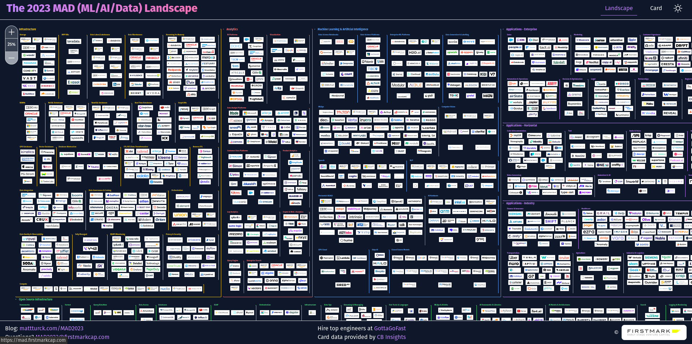

```{r set-options, echo=FALSE, cache=FALSE, purl=FALSE}
options(width = 100)
library(knitr)
```

# Big Data?

------

```{r whatis, echo=FALSE, out.width = "50%", fig.align='center', purl=FALSE}
include_graphics("../img/01_what_is.jpg")
```


-----

```{r intro, echo=FALSE, out.width = "60%", fig.align='center', purl=FALSE, fig.cap="Posted on flickr by BBVAtech in 2012, by Asigra [CC BY 2.0](https://creativecommons.org/licenses/by/2.0/)"}
include_graphics("../img/01_big_data_intro.jpg")
```


## Expert Survey (UC Berkeley, 2014)

- Ask 40 experts to define *"big data"*...


## Expert Survey (UC Berkeley, 2014)

- Ask 40 experts to define *"big data"*...
- ... get 40 different definitions :)


## Expert Survey (UC Berkeley, 2014)

```{r wordcloud, echo=FALSE, out.width = "90%", fig.align='center', purl=FALSE, fig.cap="Image by Jennifer Dutcher, datascience@berkeley, source: https://datascience.berkeley.edu/what-is-big-data/"}
include_graphics("../img/01_survey_wordcloud.png")
```


## Expert Survey: Example 1

"Big Data is the result of *collecting information at its most granular level* — it’s what you get when you instrument a system and keep all of the data that your instrumentation is able to gather."

*Jon Bruner*
(Editor-at-Large, O’Reilly Media)


## Expert Survey: Example 2

"Big data is data that contains enough observations to *demand unusual handling because of its sheer size*, though what is unusual changes over time and varies from one discipline to another."

*Annette Greiner*<br>
(Lecturer, UC Berkeley School of Information)


## Expert Survey: Example 3

"[...] 'big data' will ultimately describe any data set large enough to necessitate *high-level programming skill* and *statistically defensible methodologies* in order to transform the data asset into something of value."

*Reid Bryant*<br>
(Data Scientist, Brooks Bell)


## Conclusion

```{r hard, echo=FALSE, out.width = "60%", fig.align='center', purl=FALSE}
include_graphics("../img/01_its_hard.jpeg")
```


## Conclusion

- Large amounts of data (big *N*: many obs.; big *P*: many vars.)
- Various types/formats of data
- Unusual sources
- Speed of data flow/stream
- Use programming and statistics (in a broad sense) to extract value


## 'Learn Big Data'?

```{r landscape, echo=FALSE, out.width = "90%", fig.align='center', purl=FALSE, fig.cap="'The 2023 MAD', source: https://mad.firstmarkcap.com/"}

```


## 'Learn Big Data'?

```{r cover, echo=FALSE, out.width = "50%", fig.align='center', purl=FALSE}
include_graphics("../img/cover.jpg")
```


## Domains Affected
- How to design/set-up the machinery to handle large amounts of data? (Hardware focus, data engineering)
- How to use the existing machinery most efficiently for large amounts of data?
- How to approach the analysis of large amounts of data with econometrics?


## Focus in This Course 
- How to design/set-up the machinery to handle large amounts of data? (Hardware focus, data engineering)
- *How to use the existing machinery most efficiently for large amounts of data?*
- *How to approach the analysis of large amounts of data with econometrics?*


## Focus in This Course 
- How to design/set-up the machinery to handle large amounts of data? (Hardware focus, data engineering)
- *How to use the existing machinery most efficiently for large amounts of data?*
- *How to approach the analysis of large amounts of data with econometrics?*
    1. Compute 'usual' statistics based on large data set (many observations).


## Focus in This Course 
- How to design/set-up the machinery to handle large amounts of data? (Hardware focus, data engineering)
- *How to use the existing machinery most efficiently for large amounts of data?*
- *How to approach the analysis of large amounts of data with econometrics?*
    1. Compute 'usual' statistics based on large data set (many observations, many variables).
    2. Practical handling of large data sets for applied econometrics (gathering, storage, preparation, etc.)


# This Course

## Four Parts 

1. Setting the Scene: Analyzing Big Data (basic concepts, overview)
2. Platform: Software and Computing Resources
3. Components of Big Data Analytics (pipeline, import, cleaning, visualization)
4. Application: Topics in Big Data Econometrics 

## Objectives

- Understand the *concept of Big Data* in the context of economic research.
- Understand the *technical challenges* of Big Data Analytics and how to practically deal with them.
- Know how to *apply* the relevant econometric tools, R packages and programming practices to effectively and efficiently handle large data sets.

## Schedule

(on OLAT)

```{r schedule, echo=FALSE, out.width = "33%", fig.align='center', purl=FALSE}

```


<!-- ## Schedule {.smaller} -->

<!--  1. *Introduction:Introduction, Big Data Econometrics. BDA book: Part I* -->
<!--  2. Software/Tools, Efficient R Programming. BDA book: Chapter 4 -->
<!--  3. Hardware: Computing Resources. BDA book: Chapter 5 -->
<!--  4. Hardware: Distributed Systems. BDA book: Chapter 6 -->
<!--  5. Cloud Computing. BDA book: Chapter 7 -->
<!--  6. Big Data Compilation and Storage. BDA book: Chapter 8 -->
<!--  7. Cleaning/Preparation. BDA book: Chapter 9 -->
<!--  8. Aggregation/Descriptives/Visualization. BDA book: Chapters 10 and 11.1-11.2 -->
<!--  9. Visualization: GIS. BDA book: Chapter 11.3-11.4 -->
<!--  10. Project Presentations. -->
<!--  11. Project Presentations; Q&A. -->


## Examination

- You will be usually working in *groups of four (or three)* and conduct a *big data analytics project*.
- You will find a *"large" data set (min. 2GB)* to work with and pose *1-2 relevant research questions*.
- You will use the techniques learned in this course to handle and analyze the large data set in order to provide *empirical answers* to your research question.
- The output of this exercise has two parts:
  1. A *technical report/"take-home exercises"*, with a detailed/structured account of the technical aspects of your project.
  2. A *short presentation* of your key findings.

## Examination: Part I

- Decentral 
‐ Group examination (all given the same grades) (60%).
- Group size: 4 (or 3) students.
- "Take‐home exercises"/research report: Application of basic concepts in R when working with big data. Conceptual questions related to the application.

<center> *Submission deadline: 02.06.2023, 23:59* </center>

 
## Examination: Part II
- Decentral
- Group examination: presentation + code (all given the same grades) (40%)

<center> *22.05.2023, 14:15 - 18:00* </center>

 
# Approach

## Approach Overview  {data-background=#ffffff}

```{r approaches, echo=FALSE, out.width = "70%", fig.align='center', purl=FALSE, background="white"}
include_graphics("../img/I_approaches.png")
```


## Approaches to Big Data Analytics

1. *Statistics/econometrics and machine learning*: "Why not just take a random sample?!"
2. *Writing efficient code*: how can you generally speed up your analytics scripts? (scales with a lot of data)
3. *Use limited local computing resources more efficiently*: parallelization, virtual memory & co.
4. *Scale up and scale out*: distributed systems and cloud computing.


## R used in three ways

- A tool to analyze problems posed by large data sets.
     - For example, memory usage (in R).
- Illustration of underlying concepts (e.g. hardware/memory or parallelization).
- A practical tool for Big Data Analytics.

## Prerequisites?
  - Basic R programming skills.
  - Preparatory courses, see Prerequisites here: https://portal.unilu.ch/details?code=FS231107
    - Brief review of concepts, but no additional introduction.


# Course Resources

## Literature

**Course Book**

[Matter, Ulrich (2023): Big Data Analytics—A guide to data science practitioners making the transition to Big Data](https://umatter.github.io/BigData/)


## Literature

**Additional reading**

[Wickham, Hadley (2019): Advanced R. Second Edition, Boca Raton, FL: CRC Press](https://adv-r.hadley.nz/)

[Wickham, Hadley and Dianne Cook and Heike Hofmann (2015): Visualizing statistical models: Removing the blindfold.Statistical Analysis and Data Mining: The ASA Data Science Journal. 8(4):203‐225.](https://onlinelibrary.wiley.com/doi/full/10.1002/sam.11271?scrollTo=references)

[Schwabish, Jonathan A. (2014): An Economistʹs Guide to Visualizing Data.Journal of Economic Perspectives. 28(1):209‐234.](https://pubs.aeaweb.org/doi/pdfplus/10.1257/jep.28.1.209)

<center>*Lecture notes and slides will point to further reading...*</center>


## Notes, Slides, Code, et al.

- Compiled slides to download, links to other resources/downloads are provided online.
- [github.com/umatter/bigdata-lecture](https://github.com/umatter/bigdata-lecture)
<!-- - [StudyNet/Canvas]() -->

## TODO 

- [Install R](https://stat.ethz.ch/CRAN/), [RStudio](https://www.rstudio.com/products/rstudio/download/#download)
- Set up your own [GitHub](https://github.com/)-account
- [Get familiar with Git/GitHub](https://guides.github.com/activities/hello-world/)
- Create an [AWS](https://aws.amazon.com/) and [Google Cloud Platform](https://cloud.google.com) account.

## Q&A

- General questions about the course?
- Exchange students: additional information regarding prerequisites


# Big Data Econometrics

## Two broad categories

- *Big P*: high-dimensional econometrics, "too many variables" (you know this from Data Analytics I!).
- *Big N*: "too many observations", data does not fit into memory (main focus of this course).

## A "Big P" problem
- You analyze the prepared log data from an e-commerce website.
- The aim is to come up with a useful econometric model to predict a purchase based on the user's origin (from where was she referred to the store).
- Each user origin (domain of the previously visited site) is an explanatory variable (big P...)
- Model serves the purpose of identifying potentially important sources that should be considered in future online marketing campaigns.
- Real-life data: [Google Analytics Sample](https://console.cloud.google.com/marketplace/product/obfuscated-ga360-data/obfuscated-ga360-data?_ga=2.140068147.1003332479.1645523176-998940270.1645523176&project=onlinemedia-slant)


## The data

```{r}
# import/inspect data
ga <- read.csv("../data/ga.csv")
head(ga)

```


## Approaches based on "traditional" econometrics

- *Any ideas?*

## Better solution: lasso estimator

- Key idea: penalize complexity of the model in order to stabilize ("regularization").
- A lot of hypothesis testing is 'costly', lasso makes this cost explicit ($\lambda\sum_k{|\beta_k|}$).
- Provides an elegant way to get a sequence of candidate models (one for each $\lambda$; "regularization path").
- Procedure: first get the lasso regularization path (the candidate models sequence), then use model selection tools to choose the best model (i.e., the best $\hat{\lambda}$)

## Lasso example: estimation

```{r warning=FALSE, message=FALSE}
# load packages
library(gamlr)

# create model matrix
mm <- model.matrix(purchase~source + browser + isMobile, data = ga)
# run K-fold cross-valudation lasso
cvpurchase <- cv.gamlr(mm, ga$purchase, family="binomial")

```

## Lasso example: prediction based on "best model"

```{r}
# load packages
library(PRROC)

# use "best" model for prediction 
# (model selection based on average OSS deviance, here CV1se rule
pred <- predict(cvpurchase$gamlr, mm, type="response")

# compute tpr, fpr, plot ROC
comparison <- roc.curve(scores.class0 = pred,
                       weights.class0=ga$purchase,
                       curve=TRUE)
plot(comparison)

```


<!-- ````{r} -->
<!-- SC <- fread("https://raw.githubusercontent.com/TaddyLab/BDS/master/examples/semiconductor.csv") -->
<!-- full <- glm(FAIL ~ ., data=SC, family=binomial) -->
<!-- 1-full$deviance/full$null.deviance -->
<!-- full_sum <- summary(full) -->
<!-- full_sum$coefficients[,"Pr(>|z|)"] -->
<!-- bh <- p.adjust(full_sum$coefficients[,"Pr(>|z|)"], method = "BH") -->
<!-- bh[which(bh<0.1)][-1] # ignore intercept -->
<!-- bh_vars <- c("FAIL", names(bh[which(bh<0.1)][-1])) -->

<!-- bh_reg <- glm(FAIL ~ ., data=SC[, bh_vars, with=FALSE], family=binomial) -->

<!-- ``` -->


## *Big N* problem: least squares example

- Classical approach to estimating linear models: OLS.
- Alternative: The *Uluru* algorithm [@dhillon_2013].

## OLS as a point of reference

Recall the OLS estimator in matrix notation, given the linear model $\mathbf{y}=\mathbf{X}\beta + \epsilon$:

$\hat{\beta}_{OLS} = (\mathbf{X}^\intercal\mathbf{X})^{-1}\mathbf{X}^{\intercal}\mathbf{y}$.

## Computational bottleneck of OLS

- $\hat{\beta}_{OLS}$ depends on $(\mathbf{X}^\intercal\mathbf{X})^{-1}$.
- Large cross-product if the number of observations is large ($X$ is of dimensions $n\times p$)
- (Large) matrix inversions are computationally demanding.
     <!-- - Computational complexity is larger than $O(n^{2})$. -->
- OLS has a $O(np^{2})$ running time.

## OLS in R

```{r}
beta_ols <- 
     function(X, y) {
          
          # compute cross products and inverse
          XXi <- solve(crossprod(X,X))
          Xy <- crossprod(X, y) 
          
          return( XXi  %*% Xy )
     }
```

## Monte Carlo study

- Parameters and pseudo data

```{r}
# set parameter values
n <- 10000000
p <- 4 

# Generate sample based on Monte Carlo
# generate a design matrix (~ our 'dataset') with four variables and 10000 observations
X <- matrix(rnorm(n*p, mean = 10), ncol = p)
# add column for intercept
X <- cbind(rep(1, n), X)

```

## Monte Carlo study

- Model and model output

```{r}
# MC model
y <- 2 + 1.5*X[,2] + 4*X[,3] - 3.5*X[,4] + 0.5*X[,5] + rnorm(n)

```


## Monte Carlo study

- Performance of OLS

```{r}
# apply the ols estimator
beta_ols(X, y)
```


## The Uluru algorithm as an alternative to OLS

Following @dhillon_2013, we compute $\hat{\beta}_{Uluru}$:

$$\hat{\beta}_{Uluru}=\hat{\beta}_{FS} + \hat{\beta}_{correct}$$, where
$$\hat{\beta}_{FS} = (\mathbf{X}_{subs}^\intercal\mathbf{X}_{subs})^{-1}\mathbf{X}_{subs}^{\intercal}\mathbf{y}_{subs}$$, and
$$\hat{\beta}_{correct}= \frac{n_{subs}}{n_{rem}} \cdot (\mathbf{X}_{subs}^\intercal\mathbf{X}_{subs})^{-1} \mathbf{X}_{rem}^{\intercal}\mathbf{R}_{rem}$$, and
$$\mathbf{R}_{rem} = \mathbf{Y}_{rem} - \mathbf{X}_{rem}  \cdot \hat{\beta}_{FS}$$.

## The Uluru algorithm as an alternative to OLS

- Key idea: Compute $(\mathbf{X}^\intercal\mathbf{X})^{-1}$ only on a sub-sample ($X_{subs}$, etc.)
- If the sample is large enough (which is the case in a Big Data context), the result is approximately the same.

## Uluru algorithm in R (simplified)

```{r}

# simple version of the Uluru algorithm
beta_uluru <-
     function(X_subs, y_subs, X_rem, y_rem) {
          
          # compute beta_fs (this is simply OLS applied to the subsample)
          XXi_subs <- solve(crossprod(X_subs, X_subs))
          Xy_subs <- crossprod(X_subs, y_subs)
          b_fs <- XXi_subs  %*% Xy_subs
          
          # compute \mathbf{R}_{rem}
          R_rem <- y_rem - X_rem %*% b_fs
          
          # compute \hat{\beta}_{correct}
          b_correct <- (nrow(X_subs)/(nrow(X_rem))) * XXi_subs %*% crossprod(X_rem, R_rem)

          # beta uluru       
          return(b_fs + b_correct)
     }

```


## Uluru algorithm in R (simplified)

Test it with the same input as above:

```{r}
# set size of subsample
n_subs <- 1000
# select subsample and remainder
n_obs <- nrow(X)
X_subs <- X[1L:n_subs,]
y_subs <- y[1L:n_subs]
X_rem <- X[(n_subs+1L):n_obs,]
y_rem <- y[(n_subs+1L):n_obs]

# apply the uluru estimator
beta_uluru(X_subs, y_subs, X_rem, y_rem)
```


## Uluru algorithm: Monte Carlo study

```{r}
# define subsamples
n_subs_sizes <- seq(from = 1000, to = 500000, by=10000)
n_runs <- length(n_subs_sizes)
# compute uluru result, stop time
mc_results <- rep(NA, n_runs)
mc_times <- rep(NA, n_runs)
for (i in 1:n_runs) {
     # set size of subsample
     n_subs <- n_subs_sizes[i]
     # select subsample and remainder
     n_obs <- nrow(X)
     X_subs <- X[1L:n_subs,]
     y_subs <- y[1L:n_subs]
     X_rem <- X[(n_subs+1L):n_obs,]
     y_rem <- y[(n_subs+1L):n_obs]
     
     mc_results[i] <- beta_uluru(X_subs, y_subs, X_rem, y_rem)[2] # the first element is the intercept
     mc_times[i] <- system.time(beta_uluru(X_subs, y_subs, X_rem, y_rem))[3]
     
}

```


## Uluru algorithm: Monte Carlo study

```{r}

# compute ols results and ols time
ols_time <- system.time(beta_ols(X, y))
ols_res <- beta_ols(X, y)[2]

```


## Uluru algorithm: Monte Carlo study

- Visualize comparison with OLS.

```{r}
# load packages
library(ggplot2)

# prepare data to plot
plotdata <- data.frame(beta1 = mc_results,
                       time_elapsed = mc_times,
                       subs_size = n_subs_sizes)
```

## Uluru algorithm: Monte Carlo study

1. Computation time.

```{r}
ggplot(plotdata, aes(x = subs_size, y = time_elapsed)) +
     geom_point(color="darkgreen") + 
     geom_hline(yintercept = ols_time[3],
                color = "red", 
                size = 1) +
     theme_minimal() +
     ylab("Time elapsed") +
     xlab("Subsample size")
```

## Uluru algorithm: Monte Carlo study

2. Precision

```{r}
ggplot(plotdata, aes(x = subs_size, y = beta1)) +
     geom_hline(yintercept = ols_res,
                color = "red", 
                size = 1) +
     geom_hline(yintercept = 1.5,
                color = "green",
                size = 1) +
     geom_point(color="darkgreen") + 
     theme_minimal() +
     ylab("Estimated coefficient") +
     xlab("Subsample size")

```


## References {.smaller}

<style>
slides > slide { overflow: scroll; }
slides > slide:not(.nobackground):after {
  content: '';
}
</style>
 
 